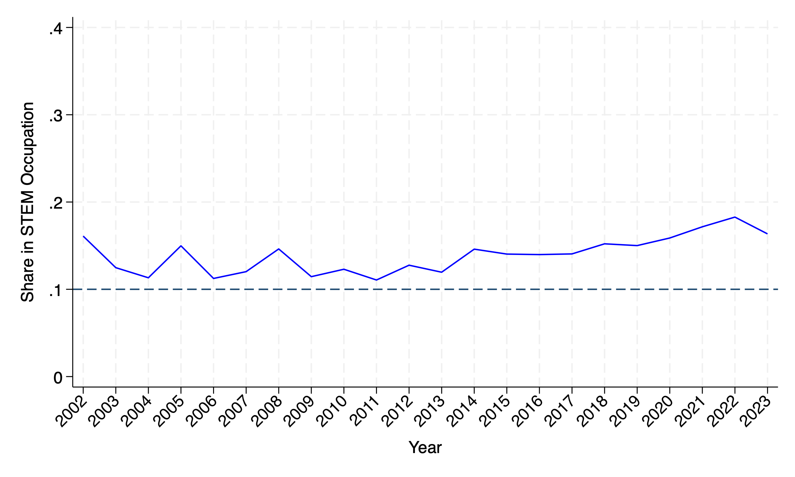
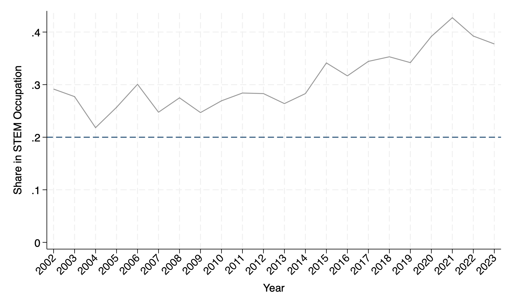
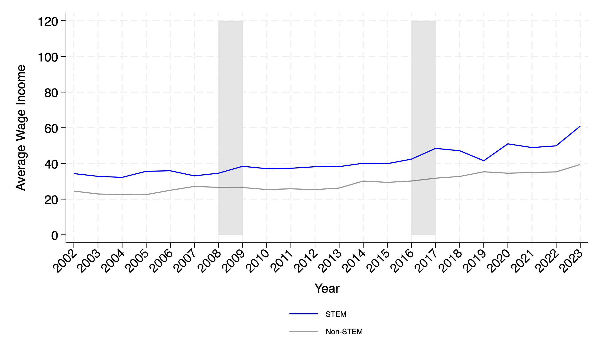
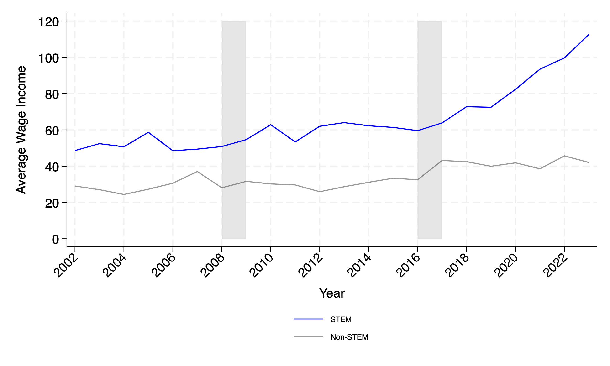

**Title:** The Effect of Optional Practice Training on Domestic and Foreign Graduates' Labor Market Outcomes
**Author:** Ruipu Gao
**Data Source:** ACES

**Summary:** This file contains the descriptive evidence part of my job market paper. The files combines pieces of the Stata code, the output figures and the brief description of the figures together.

---

> #### The proportion of domestic college graduates working in STEM occupations**
``` stata
preserve
use $mypath/Raw_data/CPS_regression_covariates.dta, clear
keep if asecwt!=.
keep if (educ==111|educ==092)&(age>=22&age<=25)
//sort year cpsidv
//by year cpsidv: drop if _n>1
gen myweight =.
replace myweight=asecwt if asecwt!=.
//replace myweight=wtfinl if wtfinl!=.
gen weight_stem =0
gen weight_nonstem=0
keep if citizen==1|citizen==2|citizen==3|citizen==4
replace weight_stem = myweight if occ_stem_indicator=="1"
replace weight_nonstem =myweight if occ_stem_indicator=="0"
collapse (sum) stem_num=weight_stem (sum) nonstem_num = weight_nonstem, by(year)
gen proportion_stem_us = stem_num/(nonstem_num+stem_num)
*drop if year>=2021
twoway ///
    (line proportion_stem_us year, lcolor(blue) lwidth(medium)), ///
    ytitle("Share in STEM Occupation") xtitle("Year") ///
    title("")  ylabel(0(0.1)0.4)   xlabel(2002(1)2023, angle(45))  ///
    graphregion(color(white)) yline(0.1, lcolor(navy))   
graph export $mypath/share_us_stem_job.png, as(png) replace 
save $mypath/dofile/Temp_data/usciti_stem_job, replace
restore
```

> This figure indicates that the share of U.S. college graduates entering STEM occupations fluctuates around 13\%–17\% over the period from 2000 to 2024, suggesting relatively stable but modest engagement in STEM careers among domestic college graduates. However, there is no obvious structural jump or drop around the 2008 or 2016 OPT policy changes, though there is a slight decline after 2008 and a slight increase after 2016. The slight fluctuation around 2008 and 2016 may imply that U.S. graduates’ entry into STEM occupations was not strongly affected by the OPT extension policies—or at least not in terms of aggregate participation. The dark dashed line at 10\% serves as a visual benchmark. The observed values consistently remain above this threshold, indicating that at least 10\% of U.S. graduates have been employed in STEM occupations throughout the sample period.

> #### The proportion of foreign college graduates working in STEM occupations.
``` stata
preserve
use $mypath/Raw_data/CPS_regression_covariates.dta, clear
keep if citizen==5
keep if asecwt!=.
keep if (educ==111|educ==092|educ==123)&(age>=22&age<=30)
//sort year cpsidv
//by year cpsidv: drop if _n>1
gen myweight =.
replace myweight=asecwt if asecwt!=.
//replace myweight=wtfinl if wtfinl!=.
gen weight_stem =0
gen weight_nonstem=0
replace weight_stem = myweight if occ_stem_indicator=="1"
replace weight_nonstem =myweight if occ_stem_indicator=="0"
collapse (sum) stem_num=weight_stem (sum) nonstem_num = weight_nonstem, by(year)
gen proportion_stem_nonus = stem_num/(nonstem_num+stem_num)
*drop if year>=2021
twoway ///
    (line proportion_stem_nonus year, lcolor(black%40) lwidth(medium)), ///
    ytitle("Share in STEM Occupation") xtitle("Year") ///
    title("")  ylabel(0(0.1)0.4) xlabel(2002(1)2023, angle(45))  ///
    graphregion(color(white))  yline(0.2, lcolor(navy))   
graph export $mypath/share_nonus_stem_job.png, as(png) replace 
save $mypath/dofile/Temp_data/nonusciti_stem_job, replace
restore
```



> This figure indicates that the share of foreign graduates working in STEM occupations rose from around 25–30\% in the early 2000s to a peak above 45\% by 2020, indicating a substantial increase in foreign graduates' engagement in STEM fields. 
Compared to the relatively flat trend for U.S. graduates in the left figure, this rising trend underscores a growing reliance on foreign talent in STEM occupations and supports the motivation for analyzing potential crowd-out effects. There also exists a sharp upward shift begins around 2015–2016, aligning closely with the second OPT STEM extension. This pattern is suggestive of a policy-driven increase in foreign STEM employment.

---
> #### Wage of domestic college graduates for STEM and non-STEM occupations

```stata
preserve
use $mypath/Raw_data/CPS_regression_covariates.dta, clear
keep if asecwt!=.
keep if citizen==1|citizen==2|citizen==3|citizen==4
keep if (educ==111|educ==092)&(age>=22&age<=25)
gen myweight =.
replace myweight=asecwt if asecwt!=.
//replace myweight=wtfinl if wtfinl!=.
gen weight_stem =0
gen weight_nonstem=0
replace weight_stem = myweight if occ_stem_indicator=="1"
replace weight_nonstem =myweight if occ_stem_indicator=="0"
gen wage_stem = incwage/1000 if occ_stem_indicator=="1"
gen wage_nonstem = incwage/1000 if occ_stem_indicator=="0"
collapse (mean) us_wage_stem=wage_stem (mean) us_wage_nonstem=wage_nonstem [pw=asecwt], by(year)
save $mypath/dofile/Temp_data/wageof_us, replace
twoway      ///
(function y=120, range(2008 2009) recast(area) color(gs14) lcolor() base(20))   ///
(function y=120, range(2016 2017) recast(area) color(gs14) lcolor() base(20))   ///
(line us_wage_stem year, lcolor(blue))   ///
(line us_wage_nonstem year, lcolor(black%40) ),    ///
xtitle("Year") ytitle("Average Wage Income")  ///
title("") legend(order(3 "STEM" 4 "Non-STEM") size(vsmall) position(6))    ///
ylabel(0(20)120) xlabel(2002(1)2023, angle(45))
graph export $mypath/us_wage.png, as(png) replace 
restore
```

> This figure presents the evidence for domestic college graduates, and implies that domestic graduates working in STEM fields consistently earn more than those in non-STEM fields throughout the entire period (2000–2024), highlighting a stable and substantial STEM wage premium. The difference in wages between STEM and non-STEM occupations remains relatively stable over time, with no sudden increases or decreases in the wage gap. This suggests that the labor market valuation of STEM skills has been consistent during the period studied. Also, the average wage income for both STEM and non-STEM domestic graduates shows a steady upward trend, indicating general income growth over time. The figure also shows a slight steepening in STEM wage growth after 2015, hinting at rising demand or inflation-driven adjustments. Same things happens after 2008 OPT extension, when the wage increased a little bit. However, despite policy changes like the 2008 and 2016 OPT extensions, and the observation of the increasing of the wages, there is no substantial change in domestic STEM wages that directly corresponds to those years. Wage effects may be subtle, lagged, or offset by broader market forces.

> #### Wage of foreign college graduates for STEM and non-STEM occupations

```stata
preserve
use $mypath/Raw_data/CPS_regression_covariates.dta, clear
keep if asecwt!=.
keep if citizen==5
keep if (educ==111|educ==092|educ==123)&(age>=22&age<=30)
gen myweight =.
replace myweight=asecwt if asecwt!=.
//replace myweight=wtfinl if wtfinl!=.
gen weight_stem =0
gen weight_nonstem=0
replace weight_stem = myweight if occ_stem_indicator=="1"
replace weight_nonstem =myweight if occ_stem_indicator=="0"
gen wage_stem = incwage/1000 if occ_stem_indicator=="1"
gen wage_nonstem = incwage/1000 if occ_stem_indicator=="0"
collapse (mean) nonus_wage_stem=wage_stem (mean) nonus_wage_nonstem=wage_nonstem [pw=asecwt], by(year)
save $mypath/dofile/Temp_data/wageof_nonus, replace
twoway      ///
(function y=120, range(2008 2009) recast(area) color(gs14) lcolor() base(0))   ///
(function y=120, range(2016 2017) recast(area) color(gs14) lcolor() base(0))   ///
(line nonus_wage_stem year,lcolor(blue))   ///
(line nonus_wage_nonstem year, lcolor(black%40) ),    ///
xtitle("Year") ytitle("Average Wage Income")  ///
title("") legend(order(3 "STEM" 4 "Non-STEM") size(vsmall) position(6))    ///
ylabel(0(20)120) xlabel(2002(2)2023, angle(45))
graph export $mypath/nonus_wage.png, as(png) replace 
restore
```



> This figure proves that foreign graduates working in STEM occupations consistently earn significantly more than their non-STEM counterparts. The gap is large and appears to widen over time, especially after 2015. STEM wages among foreign graduates accelerate rapidly after 2015, with a notable spike after 2020. This sharp increase may reflect a combination of policy changes (e.g., 2016 OPT extensions), rising demand for foreign STEM talent, and composition effects (e.g., higher-skilled or more experienced foreign STEM workers). In contrast, average wages for foreign graduates in non-STEM fields remain low and grow only slowly over the entire period. This divergence underscores the relatively weak labor market performance of foreign non-STEM graduates. The average STEM wage for foreign graduates crosses \$110,000 by 2024, nearly triple the non-STEM average (around \$43K), emphasizing the highly rewarding nature of STEM careers for foreign-born workers in the U.S. 
