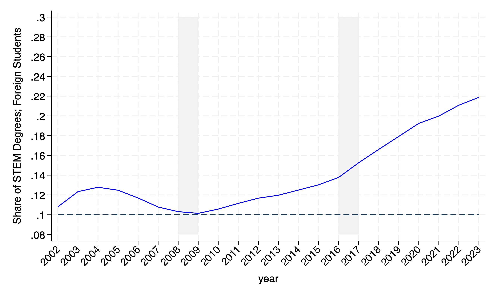
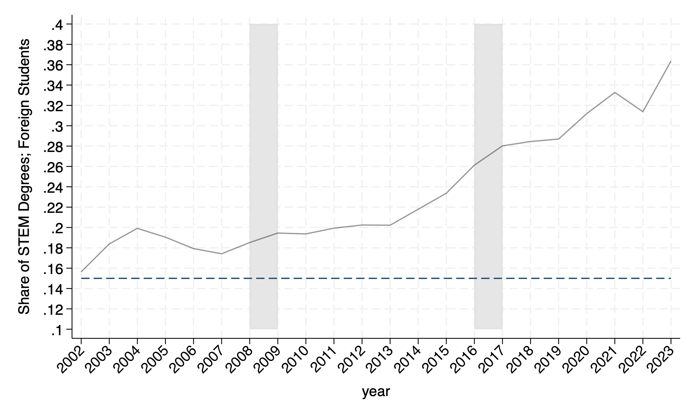
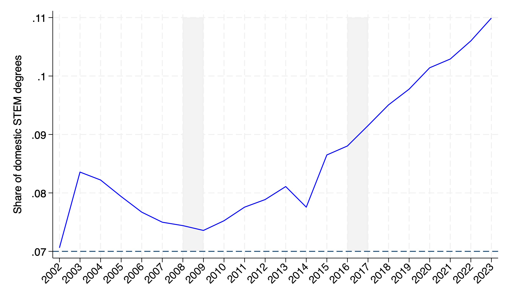
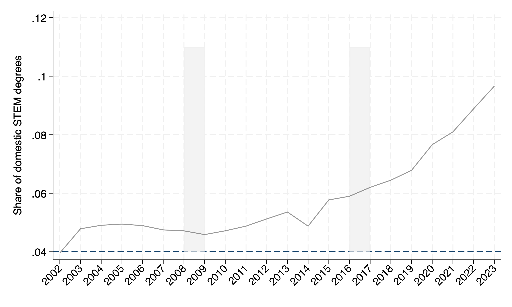

**Title:** The Effect of Optional Practice Training on Domestic and Foreign Graduates' Labor Market Outcomes
**Author:** Ruipu Gao
**Data Source:** ACES

**Summary:** This file contains the descriptive evidence part of my job market paper. The files combines pieces of the Stata code, the output figures and the brief description of the figures together.

---
> #### Proportion of STEM degrees for foreign college graduates.

```stata
preserve 
use $mypath/dofile/Temp_data/fore_stem_nonstem, clear
gen fore_stem_ratio_wrtfore=num_fore_stem/(num_fore_nonstem+num_fore_stem)
drop if year<2002
twoway ///
	(function y=0.3, range(2008 2009) recast(area)  ///
	color(gs15) lcolor(gs15) base(0.08))   ///
	(function y=0.3, range(2016 2017) recast(area)   ///
	color(gs15) lcolor(gs15) base(0.08))   ///
	(function y=0.1, range(2002 2023) ///
	lcolor(navy) lpattern(dash))      ///
    (line fore_stem_ratio_wrtfore year, lcolor(blue) yaxis(1)), ///
    ylabel(0.08(0.02)0.30) ///
    legend (off)   xtitle("year")  ///
	ytitle("Share of STEM Degrees; Foreign Students")    ///
	xlabel(2002(1)2023, angle(45))
graph export $mypath/BA_fore_stem_all_fore.png, as(png) replace
restore
```
<a name="BA_fore">![alt text]

> #### Proportion of STEM degrees for foreign master graduates.
``` stata
preserve 
use $mypath/dofile/Temp_data/fore_stem_nonstem, clear
gen fore_stem_ratio_wrtfore=num_fore_stem/(num_fore_nonstem+num_fore_stem)
drop if year<2002
twoway ///
	(function y=0.4, range(2008 2009) recast(area) color(gs14) lcolor() base(0.1))   ///
	(function y=0.4, range(2016 2017) recast(area) color(gs14) lcolor() base(0.1))   ///
    (line fore_stem_ratio_wrtfore year, lcolor(black%40) yaxis(1)) ///
	(function y=0.15, lcolor(navy) range(2002 2023) lpattern(dash)),   ///
    ylabel(0.1(0.02)0.4) ///
    legend (off)   xtitle("year")   ///
	ytitle("Share of STEM Degrees; Foreign Students")    ///
	xlabel(2002(1)2023, angle(45))
graph export $mypath/MA_fore_stem_all_fore.png, as(png) replace
restore
```

<a name="MA_fore">

> #### Proportion of STEM degrees for domestic college graduates.
```stata
preserve
use $mypath/dofile/Temp_data/new_fig_stem, clear
merge 1:1 year using $mypath/dofile/Temp_data/new_fig_all
gen share_dome_stem = domestic_stem/domestic_all
drop if year<2002
twoway    ///
(function y=0.11, range(2008 2009) recast(area)  ///
	color(gs15) lcolor(gs15) base(0.0701))   ///
	(function y=0.11, range(2016 2017) recast(area)   ///
	color(gs15) lcolor(gs15) base(0.0701))   ///
(line share_dome_stem year, lcolor(blue)),  ///
xlabel(2002(1)2023, angle(45)) ytitle("Share of domestic STEM degrees") yline(0.07, lcolor(navy)) legend(off) 
graph export $mypath/BA_dome_stem_dome.png, as(png) replace 
restore
```
<a name="BA_dome"></a>!

> #### Proportion of STEM degrees for domestic master graduates.

```stata
preserve
use $mypath/dofile/Temp_data/new_fig_stem, clear
merge 1:1 year using $mypath/dofile/Temp_data/new_fig_all
gen share_dome_stem = domestic_stem/domestic_all
drop if year<2002
twoway    ///
(function y=0.11, range(2008 2009) recast(area)  ///
	color(gs15) lcolor(gs15) base(0.0401))   ///
(function y=0.11, range(2016 2017) recast(area)   ///
	color(gs15) lcolor(gs15) base(0.0401))   ///
(line share_dome_stem year, lcolor(black%40)), xlabel(2002(1)2023, angle(45)) ytitle("Share of domestic STEM degrees") yline(0.04, lcolor(navy)) legend(off)
graph export $mypath/MA_dome_stem_dome.png, as(png) replace 
restore
```
<a name="MA_dome"></a>

---

> #### Interpretation

>[Figure1](#BA_fore) to [Figure2](#MA_fore) depicts the proportion of STEM degrees conferreed to foreign and domestic students, separately for bachelors' or associates' degree, and masters' degree. Different from the figure in introduction (Section \ref{intro}), the share is calculated by dividing the number of STEM degrees conferred to, for example, foreign students, to all students obtaining STEM degrees.[Figure1](#BA_fore) and [Figure2](#MA_fore)  shows the change in the average of the share across years. 

>Figure \ref{BA_fore} indicates that the share of STEM degrees among foreign undergraduates declined slightly between 2003–2009, then steadily increased from 2010. Also, there is notable acceleration in growth appears after 2015, and by 2023, the share reached approximately 22\%, up from around 10\% in 2002. Figure \ref{MA_fore} shows the scenario for master degrees, and indicates that the STEM share for foreign master's graduates remained relatively flat before 2015, but there is a sharp rise after 2016, surpassing 35\% by 2023. In sum, Figure \ref{MA_fore} shows the strongest post-2016 growth among all groups, possibly suggesting responsiveness to OPT expansion for STEM master’s degrees.

>For domestic students obtaining STEM degrees, [Figure3](#BA_dome) shows a mild decline from 2002 to around 2009. Starting in 2010, a consistent upward trend occurs, especially accelerating after 2015. By 2023, the share of STEM degrees among domestic undergraduates nears 11\%. [Figure 4](#MA_dome) shows the scenario for those obtaining masters' degree, and implies a quite low (around 4–6\%) proportion of STEM degrees until 2015. After 2016, there's a noticeable upward trend, reaching about 10\% by 2023. Although lower than the foreign share, domestic master’s STEM growth appears responsive post-2016.

>Overall, these figures provide a descriptive overview of how the proportion of STEM degrees has evolved over time for both foreign and domestic students, at both undergraduate and master's levels. It is important to note that these trends simply reflect the average share of STEM degrees in each group across years, as obtained from the collapsed data. As such, they do not capture any causal relationships or the direct impact of specific policy changes, but rather serve to establish the general patterns and context for the subsequent empirical analysis.